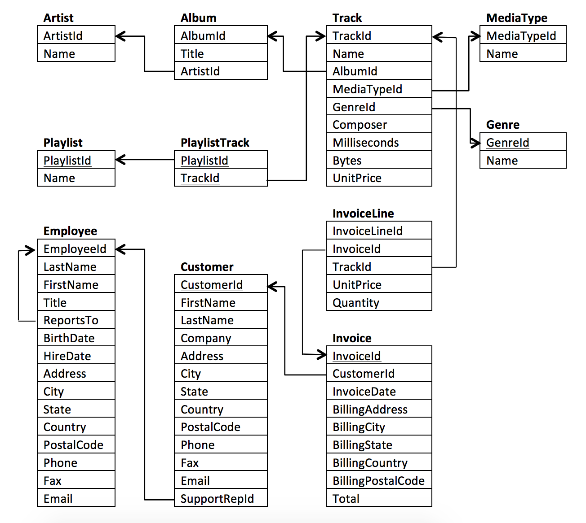
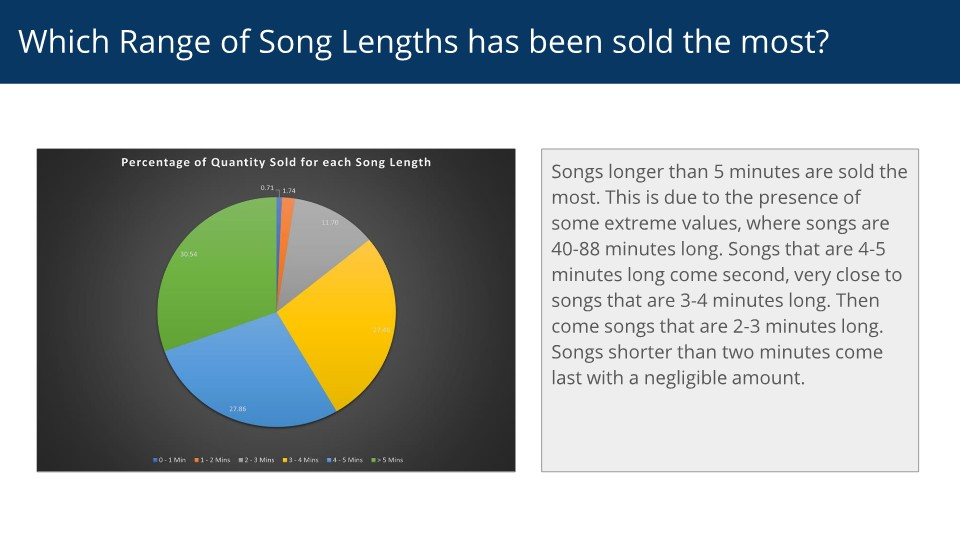
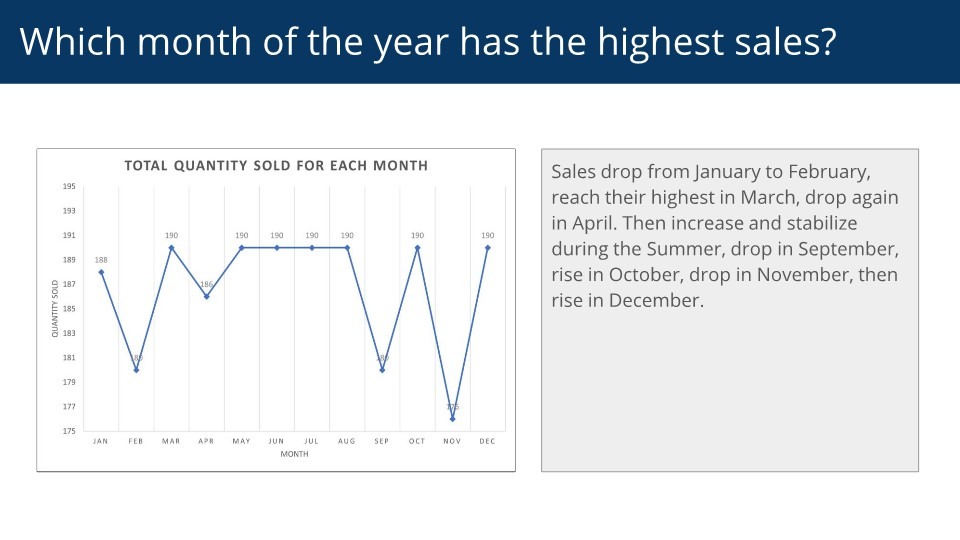

# Query a Digital Music Store Database

## Overview
This project queries the Chinook Database. The Chinook Database holds information about a music store. This project assists the Chinook team with understanding the media in their store, their customers and employees, and their invoice information by answering key question regarding the sales of digital music files at the store.

## Database ERD

## Tools Used
- DB Browser for SQLite
- Microsoft Excel
- Microsoft PowerPoint

## Screenshots

